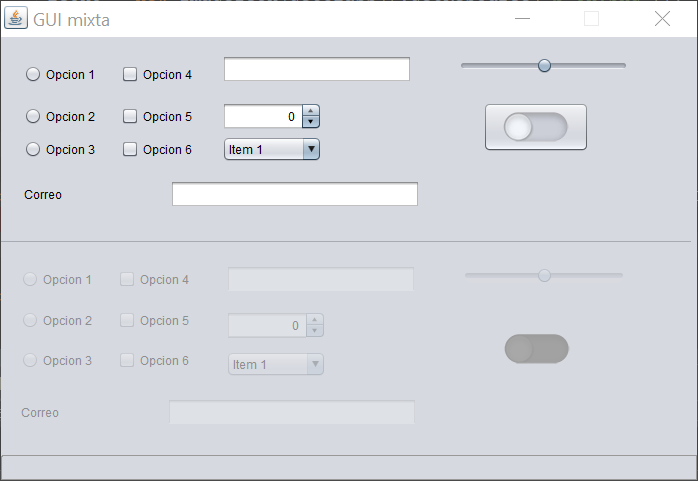

# Práctica 2.4 – Elementos interfaz duplicada

## Parte 1

Crear una interfaz con los elementos indicados y con ellos duplicados, en la que los cambios en la primera parte de la interfaz, se repitan en la otra mitad de forma automática, excepto al primer campo de texto, que deberá mostrar el duplicado con el texto en *orden inverso*.

Para ello habrá que hacer uso de los **eventos** relacionados con cada componente para duplicarlos en su correspondiente elemento. 

Hacer uso al menos de los siguientes **elementos**:

-   *2 JTextField*
-   *3 Radiobutton*
-   *3 Checkbox*
-   *1 Combobox*
-   *1 JSpinner*

Añade igualmente una **barra de estado inferior** haciendo uso de un *JPane*, la cual usaremos posteriormente.

## Parte 2

Mejora el ejercicio anterior agregando una **validación** en tiempo real del  *JTextField* del correo en el que verifique que esté correctamente formado. 
- Mientras la validación no sea correcta deberá de mostrar el cuadro de texto con un borde en color rojo.
- Al validarse correctamente, deberá mostrar un icono de un tic de validación en verde a la derecha y un mensaje en la barra de estado inferior.
